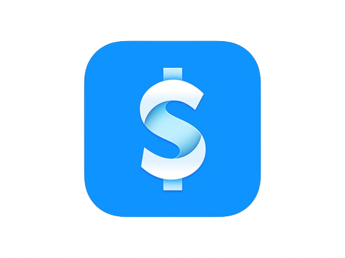

<p align="center">
  
</p>

# BitFinance


[](LICENSE.md)

BitFinance is a finance platform for tracking bills, expenses, organizations, and financial activity. This package contains the backend API.

## Features

- Multi-tenant organization management
- Member invitations through invite links
- Bill tracking with due dates, categories, and attachments
- Expense tracking with categories and attachments
- Dashboard endpoints for upcoming bills and recent expenses
- Account profile and avatar management
- JWT authentication with refresh token rotation
- HTTP-only refresh token cookies
- Multi-device session management
- Subscription plans with plan-based entitlements
- PostgreSQL persistence through Entity Framework Core
- Optional Redis caching
- Local object storage with MinIO and production S3-compatible storage
- OpenAPI and Scalar API documentation

## Tech Stack

- **.NET 10** and **C# 14**
- **ASP.NET Core** Web API
- **Entity Framework Core 10**
- **PostgreSQL 17**
- **Redis 7**
- **MinIO** for local S3-compatible storage
- **AWS S3 SDK** for object storage integration
- **Scalar** and **OpenAPI** for API documentation
- **Serilog** for structured logging
- **Azure Key Vault** for production secret loading
- **Docker Compose** for local and production orchestration

## Getting Started

### Prerequisites

- [.NET 10 SDK](https://dotnet.microsoft.com/download)
- [Docker](https://www.docker.com/) and Docker Compose
- Entity Framework Core CLI tools

Install the EF Core CLI if needed:

```bash
dotnet tool install --global dotnet-ef
```

### Local Setup

1. Create a local environment file from the monorepo root.

   ```bash
   cp apps/backend/.env.example apps/backend/.env
   ```

2. Start the development containers.

   ```bash
   docker compose --project-directory apps/backend up -d --build
   ```

   This starts the API, PostgreSQL, Redis, MinIO, and a MinIO bucket initialization container.
   Compose creates and reuses the local `bitfinance-backend_postgres-data` volume automatically.

3. Apply migrations manually if you are running the API outside Docker or need to update the database directly.

   ```bash
   dotnet ef database update --project apps/backend/src/BitFinance.Data --startup-project apps/backend/src/BitFinance.API
   ```

4. Run the API locally without Docker, if preferred.

   ```bash
   dotnet run --project apps/backend/src/BitFinance.API
   ```

When running in the Docker Compose development setup, the API is available at `http://localhost:8080`.

## Local Services

| Service | URL or port | Notes |
| --- | --- | --- |
| API | `http://localhost:8080` | Main backend API |
| Health check | `http://localhost:8080/health` | Returns API health status |
| OpenAPI document | `http://localhost:8080/openapi/v1.json` | Generated OpenAPI document |
| Scalar API reference | `http://localhost:8080/scalar/v1` | Interactive API documentation |
| PostgreSQL | `localhost:5432` | Development database |
| Redis | `localhost:6379` | Development cache |
| MinIO API | `http://localhost:9000` | Local S3-compatible storage |
| MinIO console | `http://localhost:9001` | Local storage admin UI |

Default MinIO credentials in development are `minioadmin` / `minioadmin`.

## Environment Variables

The local `.env.example` includes safe development defaults.

| Variable | Description | Development default |
| --- | --- | --- |
| `DB_USER` | PostgreSQL user | `postgres` |
| `DB_PASSWORD` | PostgreSQL password | `postgres` |
| `DB_NAME` | PostgreSQL database name | `bitfinance` |
| `REDIS_CONNECTION_STRING` | Redis connection string | `bitfinance-cache:6379` |
| `JWT_KEY` | JWT signing key | Development placeholder |
| `JWT_ISSUER` | JWT issuer | `bitfinance-dev` |
| `JWT_AUDIENCE` | JWT audience | `bitfinance-dev` |
| `JWT_EXPIRATION` | Access token lifetime in minutes | `2880` |
| `CACHE_ENABLED` | Enables Redis-backed caching | `false` |

Production deployments should use `.env.prod.example` as a template and provide real values for database credentials, JWT settings, Azure Key Vault configuration, and image tags.

## API Overview

All versioned API routes use the `/api/v1` prefix.

Primary route groups:

- `POST /api/v1/identity/register`
- `POST /api/v1/identity/login`
- `POST /api/v1/identity/refresh`
- `POST /api/v1/identity/logout`
- `GET /api/v1/identity/me`
- `POST /api/v1/identity/manage/profile`
- `POST /api/v1/identity/manage/avatar`
- `GET /api/v1/organizations`
- `POST /api/v1/organizations`
- `PATCH /api/v1/organizations/{organizationId}`
- `POST /api/v1/organizations/{organizationId}/invite`
- `POST /api/v1/organizations/join`
- `/api/v1/organizations/{organizationId}/bills`
- `/api/v1/organizations/{organizationId}/expenses`
- `/api/v1/organizations/{organizationId}/dashboard/upcoming-bills`
- `/api/v1/organizations/{organizationId}/dashboard/recent-expenses`

Use Scalar at `http://localhost:8080/scalar/v1` for the full interactive API reference.

## Database Migrations

Create a new migration with:

```bash
dotnet ef migrations add MigrationName --project apps/backend/src/BitFinance.Data --startup-project apps/backend/src/BitFinance.API
```

Apply migrations with:

```bash
dotnet ef database update --project apps/backend/src/BitFinance.Data --startup-project apps/backend/src/BitFinance.API
```

In development, the API also applies migrations automatically during startup.

## Docker

Start the default development stack:

```bash
docker compose --project-directory apps/backend up -d --build
```

View logs:

```bash
docker compose --project-directory apps/backend logs -f bitfinance-api
```

Stop the stack:

```bash
docker compose --project-directory apps/backend down
```

Start the production overlay with a prebuilt image:

```bash
docker compose --project-directory apps/backend \
  -f apps/backend/docker-compose.yml \
  -f apps/backend/docker-compose.prod.yml \
  up --no-build -d
```

The production overlay expects the external volume configured by
`POSTGRES_DATA_VOLUME` to exist before startup:

```bash
docker volume create bitfinance_postgres-data
```

If `POSTGRES_DATA_VOLUME` uses another name, create that volume instead.

## Security Notes

- Do not commit real `.env` files.
- Generate a strong production JWT key with `openssl rand -hex 32`.
- Use Azure Key Vault for production secrets when deploying with the production configuration.
- Refresh tokens are stored in HTTP-only cookies.
- CORS is configured from `Cors:AllowedOrigins`; development allows `http://localhost:3000`.

## License

Distributed under the MIT License. See `LICENSE.md` for details.
