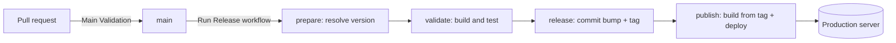

# Releases and deployment

BitFinance has three independently released apps: **backend**, **mcp-server** and **frontend**. Each app has its own version and its own release tags (`backend/v1.12.4`, `mcp-server/v0.5.1`, `frontend/v2.1.3`), and all of them deploy to the same production server.

## Overview



1. Pull requests are validated by **Main Validation**. They never change app versions.
2. When an app is ready to ship, someone runs the **Release** workflow for that app on `main`.
3. Release bumps the version, validates the app, commits the bump, tags it and calls the app's publish workflow.
4. The publish workflow builds from the tag and deploys it to production.

## Workflows

| Workflow | File | Trigger | Purpose |
|---|---|---|---|
| Main Validation | `main-validation.yml` | Pull requests and pushes to `main` | Validates the apps whose files changed |
| Validate | `validate.yml` | Called by Main Validation and Release | Build, test and lint steps for one app |
| Release | `release.yml` | Manual (`workflow_dispatch`) | The only way to release a new version |
| Backend Publish | `backend-docker-publish.yml` | Called by Release, or manual to republish | Docker image, database migrations and API deploy |
| MCP Server Publish | `mcp-docker-publish.yml` | Called by Release, or manual to republish | Docker image and MCP server deploy |
| Frontend Publish | `frontend-deploy.yml` | Called by Release, or manual to republish | Static build and atomic deploy |

## Releasing an app

Run **Actions → Release → Run workflow** on `main`:

- **app**: `backend`, `frontend` or `mcp-server`
- **version**: `patch`, `minor`, `major`, or an exact version such as `1.13.0` or `2.0.0-beta.1`

The workflow then runs these jobs:

1. **prepare** resolves the next version with `scripts/bump-version.mjs` and fails if the tag `<app>/vX.Y.Z` already exists.
2. **validate** runs the same checks as pull requests for that app.
3. **release** commits `chore(release): prepare <app> vX.Y.Z` to `main` as `github-actions[bot]`, creates the tag, and pushes both with `git push --atomic`. If `main` received a new commit during the run, the push is rejected and nothing changes, so run the release again.
4. **publish** calls the app's publish workflow with the new version.

Nothing is committed or tagged until validation passes. A failed `prepare` or `validate` leaves the repository untouched.

Only one release runs at a time, across all apps, because every release commits to `main`.

An exact version equal to the current one, for example releasing `0.5.1` when the project already declares `0.5.1`, creates the tag without a bump commit.

### Where versions live

| App | File |
|---|---|
| backend | `<Version>` in `apps/backend/src/BitFinance.API/BitFinance.API.csproj` |
| mcp-server | `<Version>` in `apps/mcp-server/src/BitFinance.MCP.csproj` |
| frontend | `version` in `apps/frontend/package.json` |

`AssemblyVersion` and `FileVersion` are derived from `<Version>` by the .NET SDK. Do not add them back to the csproj files.

Do not change versions in pull requests. To check or bump a version locally:

```bash
node scripts/bump-version.mjs backend         # prints the current version
node scripts/bump-version.mjs backend patch   # writes and prints the next version
```

## What each publish workflow deploys

All publish workflows build from the release tag (`<app>/v<version>`), first check that the project file declares that same version, and run in the `production` GitHub environment. They reach the server through Tailscale and SSH.

### Backend

1. Builds `gustmrg/bitfinance-backend` for `linux/amd64` and `linux/arm64` and pushes it to Docker Hub as `<version>` and `latest`.
2. On the server, in `DEPLOY_PATH`, it uses `docker-compose.yml` and `docker-compose.prod.yml` to:
   - pull the `bitfinance-api` image with `IMAGE_TAG=<version>`;
   - apply database migrations with `docker compose run --rm --no-deps bitfinance-api --migrate`;
   - restart `bitfinance-api` with the new image.

The deploy prints the service status and recent logs, including when it fails.

### MCP server

1. Builds `gustmrg/bitfinance-mcp-server` for `linux/amd64` and `linux/arm64` and pushes it to Docker Hub as `<version>` and `latest`.
2. On the server, in `DEPLOY_PATH`, it pulls and restarts only `bitfinance-mcp-server` (`--no-deps`) with `MCP_IMAGE_TAG=<version>`.

The backend and the MCP server share the compose project in `apps/backend` (`docker-compose.prod.yml` defines both services) and the same `DEPLOY_PATH`.

### Frontend

1. Builds the app with `.env.production.example`, writes `dist/version.json` (version, commit, tag, build time), and keeps the archive as a workflow artifact for 90 days.
2. Copies the archive to the server and extracts it to `/var/www/bitfinance/releases/<version>`.
3. Switches the `/var/www/bitfinance/current` symlink to that release atomically (`mv -T`). The web server serves `current`.

Release directories are immutable. Deploying a version that already exists on the server reuses its files and only switches `current`.

## Rolling back or republishing

To put an earlier release back in production, run that app's publish workflow manually (**Backend Publish**, **MCP Server Publish** or **Frontend Publish**) with the version to deploy. It builds from the existing `<app>/vX.Y.Z` tag. The version on `main` does not change.

Things to know:

- **Backend migrations are not reverted.** A rollback runs the older image's migrations, which only applies missing ones. If the newer release changed the schema in a way the older code cannot handle, revert the schema with a new migration instead of rolling back.
- **`latest` moves with every publish, including a republish.** The deploys set the image tag explicitly, so a `docker compose up` on the server without `IMAGE_TAG` / `MCP_IMAGE_TAG` uses the value in the server's `.env`.
- **Pushing a tag by hand deploys nothing.** Publishing only happens through Release or a manual run of a publish workflow.

## Configuration

GitHub secrets used by the publish workflows:

| Secret | Used by | Purpose |
|---|---|---|
| `DOCKERHUB_USERNAME`, `DOCKERHUB_TOKEN` | Backend, MCP server | Push images to Docker Hub |
| `TS_OAUTH_CLIENT_ID`, `TS_OAUTH_SECRET` | All | Join the Tailscale network as `tag:ci` |
| `TAILSCALE_HOST` | All | Server address on Tailscale; preferred over `SSH_HOST` |
| `SSH_HOST` | All | Fallback server address |
| `SSH_USERNAME`, `SSH_KEY` | All | SSH login |
| `SSH_PORT` | All | Optional, defaults to `22` |
| `DEPLOY_PATH` | Backend, MCP server | Directory with the compose files and `.env` on the server |

Server-side requirements:

- `DEPLOY_PATH` contains `docker-compose.yml`, `docker-compose.prod.yml` and `.env`. Use `apps/backend/.env.prod.example` as the template for `.env`.
- The external Postgres volume (`POSTGRES_DATA_VOLUME`, default `bitfinance_postgres-data`) exists. See `apps/backend/README.md`.
- The SSH user can run `docker compose` and can write to `/var/www/bitfinance` without `sudo`.

`main` is not branch-protected. If it becomes protected, allow `github-actions[bot]` to bypass the rules, or the release job cannot push the bump commit and the tag.
